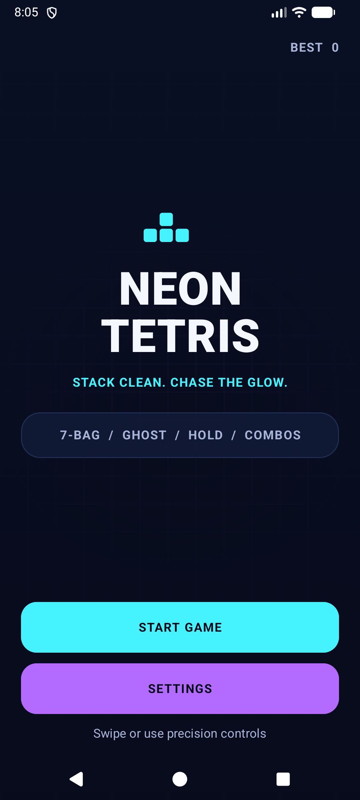
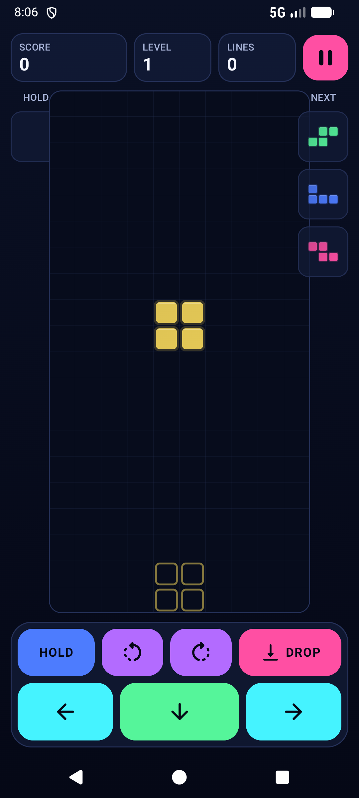
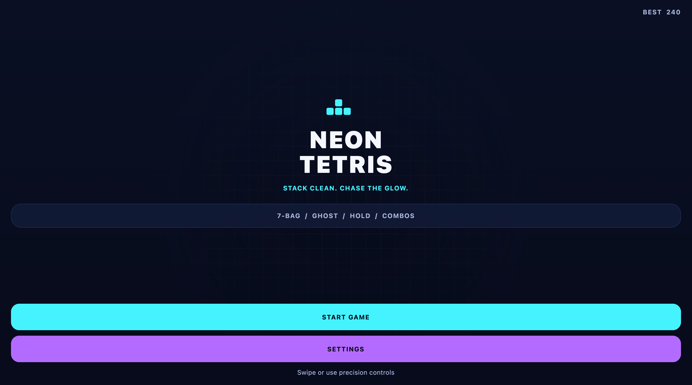
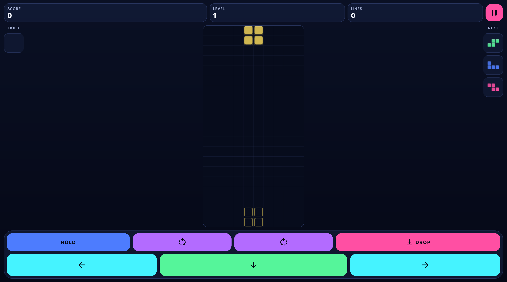
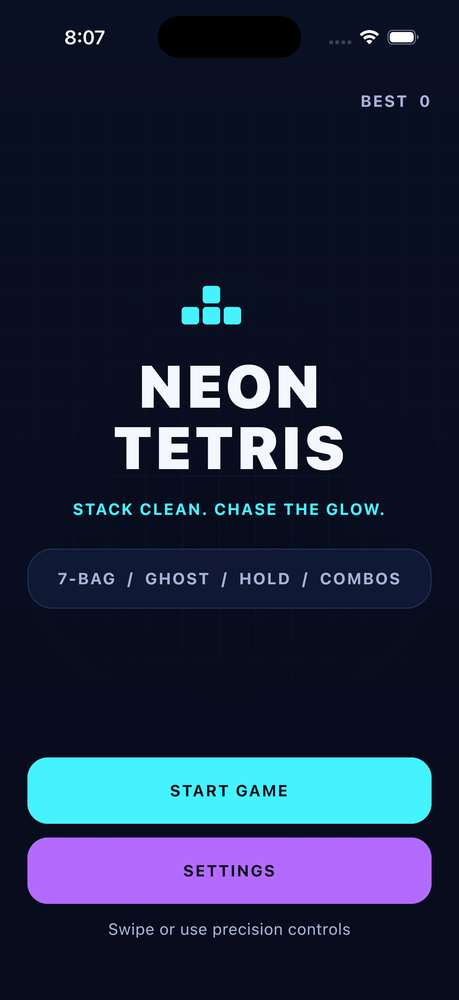
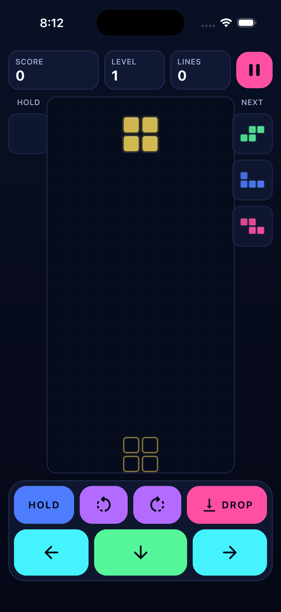

# Neon Tetris

Neon Tetris is a polished Kotlin Multiplatform falling-block puzzle game for Android, desktop, and iOS. Its game engine, state management, Compose Multiplatform UI, procedural soundtrack, and preferences contract are shared while each target keeps a thin native host.

> This is an independent educational project and is not affiliated with or endorsed by The Tetris Company.

## Product goals

- Make every action feel immediate: movement, rotation, soft drop, hard drop, hold, pause, and restart.
- Keep the board readable under pressure with strong contrast, a restrained glow system, and clear piece silhouettes.
- Use animation to communicate state changes, never to delay input.
- Support short casual sessions and longer score-chasing runs.
- Remain playable with reduced motion, haptics disabled, or sound disabled.
- Keep gameplay deterministic and independently testable.

## Gameplay

- Standard 10 x 20 visible playfield with hidden spawn rows.
- Seven tetrominoes generated through a deterministic 7-bag randomizer.
- Clockwise and counter-clockwise rotation with wall-kick support.
- Soft drop, hard drop, ghost piece, hold slot, and three-piece preview queue.
- Lock delay with reset limits to keep movement responsive without allowing infinite stalling.
- Single, double, triple, and four-line clears.
- Level progression, increasing gravity, score multipliers, combos, and back-to-back bonuses.
- Pause, resume, restart confirmation, game-over summary, and quick replay.
- Persisted high score and player preferences.

## UI and motion

- Edge-to-edge, portrait-first Compose layout that adapts to resizable screens.
- Neon-on-midnight design system with distinct, accessible tetromino colors.
- Animated piece translation and rotation with input-first timing.
- Ghost-piece fade, landing pulse, line-clear flash and collapse, score popups, combo treatment, and level-up transition.
- Animated home, pause, and game-over surfaces with consistent button press states.
- Optional haptic feedback for rotate, hard drop, line clear, and game over.
- Looping procedural neon chiptune with lightweight game effects.
- Reduced-motion mode that replaces spatial effects with opacity and color feedback.

## Controls

| Action | Touch control |
| --- | --- |
| Move | Large left and right arrow buttons or horizontal swipe |
| Soft drop | Large down-arrow button or downward drag |
| Hard drop | Pink drop action or quick downward fling |
| Rotate | Rotate-left and rotate-right icon buttons or tap gesture |
| Hold | Hold button near the playfield |
| Pause | Pause button in the game HUD |

## Targets

- **Android:** production APK with native `SharedPreferences`, `AudioTrack`, effects, haptics, and lifecycle integration.
- **Desktop:** runnable Compose JVM application with persistent preferences, native Java Sound audio, responsive window sizing, and a macOS DMG distribution.
- **iOS:** SwiftUI host generated with XcodeGen and backed by the shared Compose `MainViewController`, `NSUserDefaults`, AVAudioEngine music, and native effects.

| Target | Host | Shared implementation | Verified environment |
| --- | --- | --- | --- |
| Android | `app` Android application | Engine, state, Compose UI, music, and settings contract | `Resizable_Experimental`, 1080 x 2400 |
| Desktop | `shared` JVM entry point | Engine, state, Compose UI, and procedural soundtrack | macOS, 1512 x 871 wide window |
| iOS | `iosApp` SwiftUI/XcodeGen host | Engine, state, Compose UI, and soundtrack synthesis | iPhone 17 Pro, iOS 26.5 |

## Architecture

The app follows a unidirectional state-flow architecture with platform services injected at the host boundary.

```text
app/
  Android activity, preferences, and audio implementations

shared/src/commonMain/
  core/game/        Pure Kotlin rules, board, pieces, scoring, timing, and reducer logic
  data/             Shared preferences state and storage contract
  audio/            Shared soundtrack synthesis and audio contract
  ui/               Compose Multiplatform screens, controls, renderer, and ViewModel
  theme/            Shared color and typography system

shared/src/androidMain/
  Android system-back integration

shared/src/desktopMain/
  Desktop window, preferences, and audio implementation

shared/src/iosMain/
  Compose UIViewController, NSUserDefaults, AVAudioEngine, and native effects

iosApp/
  SwiftUI application host, Info.plist, and generated Xcode project
```

The engine receives explicit actions and time steps and returns immutable state. Compose renders that state, while the ViewModel owns the frame loop, lifecycle behavior, persistence coordination, and one-shot feedback events.

## Quality strategy

- **Common engine tests:** collision, spawn, movement, line clearing, bag generation, hold rules, and pause behavior on Android host and desktop targets.
- **ViewModel tests:** frame progression, pause/resume, settings application, restart, and persisted score updates.
- **Compose tests:** home-to-game flow, controls, pause overlay, settings, and game-over actions.
- **Device verification:** build and install the debug APK, inspect the UI hierarchy, exercise a gameplay journey, rotate/resize where relevant, and visually review captured screenshots.
- **Performance checks:** avoid per-frame allocation in board rendering, keep animation state bounded, and verify input remains responsive during line-clear effects.

## Delivery checkpoints

1. Project scaffold, README, Git initialization, and GitHub repository.
2. Architecture, navigation foundation, and neon design system.
3. Deterministic game engine with focused unit tests.
4. Responsive gameplay UI, HUD, previews, and touch controls.
5. Motion, haptics, visual feedback, and reduced-motion behavior.
6. Persistence, settings, accessibility, and lifecycle handling.
7. Full build, test, emulator, and gameplay verification.
8. Final screenshots, README update, and release-ready repository state.

Each checkpoint is committed and pushed independently so the repository history documents the implementation sequence.

## Screenshots

### Android

<table>
  <tr>
    <th>Home</th>
    <th>Gameplay</th>
  </tr>
  <tr>
    <td></td>
    <td></td>
  </tr>
  <tr>
    <th>Pause</th>
    <th>Settings</th>
  </tr>
  <tr>
    <td></td>
    <td></td>
  </tr>
</table>

### Desktop

<table>
  <tr>
    <th>Wide home</th>
    <th>Wide gameplay</th>
  </tr>
  <tr>
    <td></td>
    <td></td>
  </tr>
</table>

### iOS

<table>
  <tr>
    <th>Home</th>
    <th>Gameplay</th>
  </tr>
  <tr>
    <td></td>
    <td></td>
  </tr>
</table>

The six home/gameplay captures were regenerated from the current source. Android uses `Resizable_Experimental` at 1080 x 2400, desktop uses a 1512 x 871 wide window, and iOS uses an iPhone 17 Pro simulator on iOS 26.5. Each screen was visually reviewed after capture.

## Verification

- Android debug APK and instrumented-test APK build successfully with Android Gradle Plugin 9.0.1.
- Six deterministic shared engine tests pass on Android host and desktop targets.
- Three production-activity Compose journeys pass on `Resizable_Experimental`.
- Shared UI and platform code compile for iOS x64, arm64, and simulator arm64 targets.
- The complete unsigned iPhoneOS app links as an arm64 device application with Xcode 26.5.
- The iOS app builds and launches on an iPhone 17 Pro simulator running iOS 26.5; home and gameplay were exercised through the accessibility hierarchy.
- The desktop application launches at its portrait default and remains bounded when resized to 1512 x 871; the board, HUD, previews, and both control rows remain visible.
- Desktop packages as `shared/build/compose/binaries/main/dmg/Neon Tetris-1.0.0.dmg`.
- Android home and gameplay were visually rechecked at 1080 x 2400 on `Resizable_Experimental`.

## Build

```bash
./gradlew :app:assembleDebug
./gradlew :shared:desktopTest :shared:testAndroidHostTest
./gradlew :shared:compileKotlinIosSimulatorArm64
```

Run Android on the verified emulator:

```bash
android emulator start Resizable_Experimental
android run \
  --device=emulator-5554 \
  --type=ACTIVITY \
  --activity=com.himugupta.neontetris.MainActivity \
  --apks=app/build/outputs/apk/debug/app-debug.apk
```

Run desktop directly from Gradle:

```bash
./gradlew :shared:run
```

Generate and open the iOS host project:

```bash
cd iosApp
xcodegen generate
open NeonTetrisIOS.xcodeproj
```

Build and launch the iOS simulator target from the command line:

```bash
xcodebuild \
  -project iosApp/NeonTetrisIOS.xcodeproj \
  -scheme NeonTetris \
  -configuration Debug \
  -sdk iphonesimulator \
  -destination 'platform=iOS Simulator,name=iPhone 17 Pro' \
  -derivedDataPath iosApp/build-simulator \
  CODE_SIGNING_ALLOWED=NO \
  build

xcrun simctl install booted \
  'iosApp/build-simulator/Build/Products/Debug-iphonesimulator/Neon Tetris.app'
xcrun simctl launch booted com.himugupta.neontetris
```

Build the unsigned physical-device target from the command line:

```bash
xcodebuild \
  -project iosApp/NeonTetrisIOS.xcodeproj \
  -target NeonTetris \
  -configuration Debug \
  -sdk iphoneos \
  CODE_SIGNING_ALLOWED=NO \
  ARCHS=arm64 \
  ONLY_ACTIVE_ARCH=YES \
  build
```

For a real iPhone or iPad, connect and trust the device, select an Apple development team in Xcode, choose the device, and run the `NeonTetris` scheme.

Create the macOS DMG with a full JDK 17 that includes `jpackage`:

```bash
./gradlew :shared:packageDistributionForCurrentOS
```

The Android target uses API 36, supports Android 8.0+ (API 26), and all JVM targets use Java 17.
